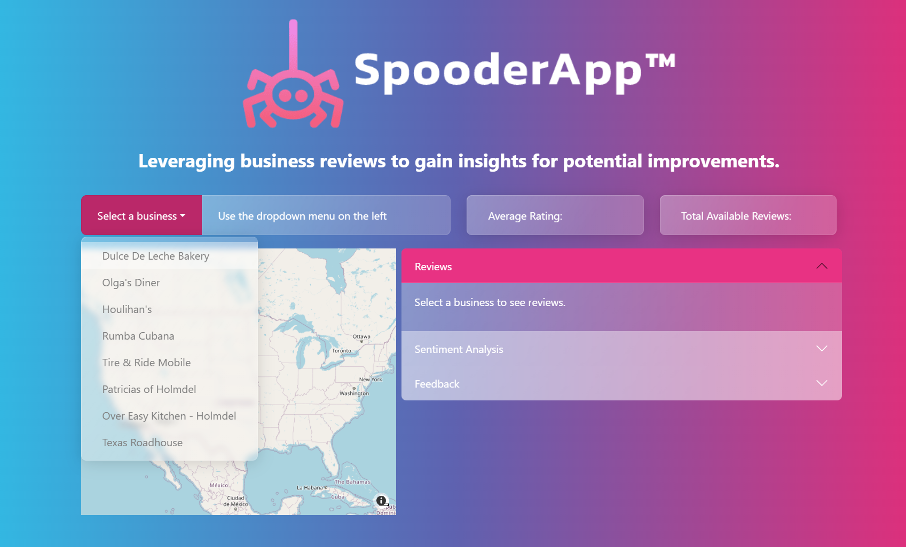

# AI_Project_3_Group_01

## *Leveraging Reviews to Understand Consumer Sentiments*
*Powered by* `roberto` *and* `davidlingo`

### Meet the team:

| Member | Role |
| :--- | :--- |
| Ramona Ciobanu | Presentaiton Lead |
| Christian Leon | EDA Lead, Transformer Lead |
| Leigh Nash | `README` Lead |
| Angelica Padilla | Web Scraper Lead, LangChain Lead |
| Odele Pax | Project Manager |
| Vanessa Wright | Git Lead, Support for all, Absolute Hero |

---

# Table of Contents

* [Project Details](#Project-Details)
* [Project Management](#Project-Management)
* [Execution](#Execution)
* [Conclusion](#Conclusion)
* [Citations](#Citations)

---

# Project Details

## *Thesis:*

This project aims to explore the relationship between various business attributes and review ratings. We hypothesize that certain business attributes (e.g., reviews, location, service quality, etc.) can be used to train AI to analyze and make suggestions to improve the businesses.

---

## Data

To prepare our sentiment analysis model, we leveraged the __[Yelp Open Dataset](https://www.yelp.com/dataset)__ to harness existing reviews and ratings. These datasets cover aspects such as business information, customer check-ins, reviews, tips, and user data.

---

# Project Management

## Overview

| Phase | Details |
| :--- | :--- |
| Data Sourcing | Data was sourced from the [Yelp Open Dataset](#Citations)   |
| Version Control | Git strategy for collaborative work across team members  |
| EDA | Initial exploration of datasets to understand data structure and identify key variables   
| Merging Datasets | The reviews and business datasets were merged based on the `business_id`. The tips dataset was also considered but was ultimately not merged due to data loss during merging. |
| Preprocessing | Data cleaning, feature selection, and merging of datasets to create a unified analysis dataset  |
| Modeling | Developed and fine-tuned machine learning models, primarily using BERT-based models, to classify and analyze sentiments. |
| Spooder App | Built a web application using Dash to provide an interactive interface for analyzing business reviews. |

## Installations
Installing necessary libraries 
*NOTE: Uncomment any libraries not currently present in your environment for initial execution of this notebook*

| **General Utilities** | *Notes* |
| :--- | :--- |
| `%pip install pandas --quiet` | Data manipulation and analysis|
| `%pip install numpy --quiet` | Numerical computations|
|` %pip install scipy --quiet` | Scientific computing|
| `%pip install matplotlib --quiet` | Plotting and visualization|
| `%pip install seaborn --quiet` | Statistical data visualization|
| `%pip install tqdm --quiet` | Progress bar for loops|
| `%pip install gdown --quiet` | Downloading files from Google Drive|
| `%pip install zipfile --quiet` | Working with zip files|
| `%pip install json --quiet` | JSON handling|
| **Machine Learning & NLP** | *Notes* |
| `%pip install torch --quiet` | PyTorch for deep learning|
| `%pip install transformers --quiet` | HuggingFace Transformers|
| `%pip install datasets --quiet` | HuggingFace Datasets|
| `%pip install scikit-learn --quiet` | Machine learning tools|
| `%pip install nltk --quiet` | Natural Language Toolkit for text processing|
| `%pip install accelerate --quiet` | Accelerate training|
| `%pip install evaluate --quiet` | Metric evaluation|
| **Web Scraping** | *Notes* |
| `%pip install selenium --quiet` | Browser automation|
| `%pip install webdriver-manager --quiet` | Manage WebDriver binaries|
| `%pip install beautifulsoup4 --quiet` | Parsing HTML and XML|
| **Environment & API** | *Notes* |
| `%pip install python-dotenv --quiet` | Load environment variables|
| `%pip install langchain --quiet` | OpenAI LangChain for AI models|
| **Dash (Web App Framework)** | *Notes* |
| `%pip install dash --quiet` | # Dash core components|
| `%pip install dash-bootstrap-components --quiet` | Dash Bootstrap components|
| **Plotting & Visualization** | *Notes* |
| `%pip install plotly --quiet` | Interactive graphing library|
| **Image Handling** | *Notes* |
| `%pip install opencv-python-headless --quiet` | OpenCV for image processing|

## Imports and Dependencies
| **General Utilities** | *Notes* |
| :--- | :--- |
| `import pandas as pd` | Data manipulation and analysis |
| `import os` | Operating system interfaces |
| `import re` | Regular expressions |
| `import json` | JSON handling |
| `import time` | Time management |
| `import zipfile` | Working with zip files |
| `import unicodedata` | Unicode character handling |
| `import numpy as np` | Numerical computations |
| `import scipy as sp` | Scientific computing |
| `import gdown` | Google Drive file download |
| `from tqdm import tqdm` | Progress bar for loops |
| `import base64` | Encoding and decoding binary data |
| `from io import BytesIO` | Handling binary data in memory |
| **Image Handling** | *Notes* |
| `import cv2` | OpenCV for image processing |
| `from PIL import Image` | Image processing via PIL (for handling image conversion) |
| **Plotting and Visualization** | *Notes* |
| `import matplotlib.pyplot as plt` | Plotting and visualization |
| `import matplotlib.ticker as mtick` | Setting ticks to larger numbers |
| `import seaborn as sns` | Statistical data visualization |
| `import plotly.express as px` | Simple interactive plots |
| `import plotly.graph_objects as go` | Detailed interactive plots |
| **Machine Learning & NLP** | *Notes* |
| `import torch` | PyTorch for deep learning |
| `from sklearn.model_selection import train_test_split` | Data splitting for training and testing |
| `from datasets import load_metric` | Compute metrics for NLP models |
| `import nltk` | Natural Language Toolkit for text processing |
| `from nltk.corpus import stopwords` | Stop words for text preprocessing |
| `from nltk.tokenize import word_tokenize` | Tokenization of text |
| `import transformers` | HuggingFace Transformers |
| **Pretrained Model and Tokenization** | *Notes* |
| `from transformers import DistilBertForSequenceClassification, DistilBertTokenizer` | DistilBERT model and tokenizer |
| `from transformers import AutoTokenizer, AutoModelForSequenceClassification` | Auto-tokenizer and model for sequence classification |
| `from transformers import DataCollatorWithPadding` | Dynamic padding for batched data |
| `from transformers import TrainingArguments, Trainer` | Training arguments and trainer |
| `from transformers import pipeline` | Inference pipeline |
| **Dataset Formatting** | *Notes* |
| `import accelerate` | Accelerate training |
| `from datasets import Dataset` | Dataset handling |
| `from evaluate import load` | Metric evaluation |
| **Web Scraping** | *Notes* |
| `from selenium import webdriver` | Browser automation |
| `from selenium.webdriver.chrome.service import Service as ChromeService` | WebDriver service for Chrome |
| `from selenium.webdriver.support.ui import WebDriverWait` | WebDriver wait |
| `from selenium.webdriver.common.by import By` | Locating elements by attributes |
| `from selenium.webdriver.support import expected_conditions as EC` | Expected conditions for WebDriver waits |
| `from webdriver_manager.chrome import ChromeDriverManager` | Manage WebDriver binaries |
| `from bs4 import BeautifulSoup` | Parsing HTML and XML |
| **Environment & API** | *Notes* |
| `from dotenv import load_dotenv` | Load environment variables |
| `from langchain_openai import ChatOpenAI` | OpenAI API for LangChain |
| **Prompt Template and LLM Chain** | *Notes* |
| `from langchain import PromptTemplate` | Prompt template for LangChain |
| `from langchain.chains import LLMChain` | LLM Chain for linking models |
| **Dash (Web App Framework)** | *Notes* |
| `from dash import Dash, dcc, html, callback, callback_context` | Dash core components and callbacks |
| `from dash.dependencies import Input, Output, State` | Dash dependencies for callbacks |
| `from dash.exceptions import PreventUpdate` | Prevent updates in callbacks |
| `import dash_bootstrap_components as dbc` | Dash Bootstrap components |
| **Other** | *Notes* |
| `import math` | Mathematical functions |

### Methods
Data Management with gdown due to the large size of the training files required for our models, alternative storage solutions to Git were necessary as a result of storage limits. We selected `gdown` for its integration with Google Drive.

The notebook `json_conversion_for_gdown.ipynb` serves to convert our source files and test functions for retrieval from Google Drive. After successful tests, the relevant code was integrated into our main working notebooks. This notebook is retained in Resources/ for reference.

This project includes multiple components such as data fetching, exploratory data analysis (EDA), data integration, BERT-based Models, web scraping, LangChain, and OpenAI:
- **Data Fetching: Automated scripts to download data from Google Drive.**
- **EDA: Scripts for performing initial exploratory data analysis on the fetched data.**
- **Sentiment Analysis Using BERT-based Models: Use trained model on test dataset to predict sentiments**
- **Universal Business Review Sentiment Analysis**
- **Review Scraping: Scripts to scrape reviews and other details from Google Maps using Selenium and BeautifulSoup.**
- **Apply the Sentiment Analysis Model to the Web Scrapped Data**
- **se Reviews from Selected Business to run ChatGPT Model**
- **Spooder Ap**

### Instructions for Running the Code:
1.  Clone repository to a local directory.
2.  Ensure necessary API Keys are present in your local `.env`.
3.  Uncomment neccesary `pip install`s as needed from `[notebook]`.
4.  If executing for the first time, uncomment any `gdown` fetch cells and comment out their corresponding `.csv` read ins.
If, however, you are executing the notebook any subsequent time, comment out all instances of `gdown` fetch requests, and instead utilize their corresponding `.csv` read ins.
5.  `Run All Cells` to execute the code in every cell of the notebook in sequence. Alternatively, each cell may be `Run` on its own, though it is still recommended to run them in order.  *Note: This will launch the application* `SpooderApp™` *in your default browser.*
6.  Consult onscreen guide in `SpooderApp™` interface for use.

---

# Execution
*Detailed steps of the notebook's execution*

## Fetching Data:

### User Defined Functions:
*declared in this section*
| **Function** | *Details* |
| :--- | :--- |
| `fetch_data(set)` | Downloads and reads datasets into DataFrames |

Use the provided scripts to download datasets from Google Drive. Alternatively, the data can be directly download from https://www.yelp.com/dataset and processed, dependent on the user's computing power and graphic card. Uncomment appropriate code if datasets are download directly. The 5 datasets from Yelp contain Business dataset, Checkin dataset, Reviews dataset, Tips dataset, and User dataset.

## Performing EDA:

Analyze the data to uncover insights and prepare for further processing.
    We began by loading and examining the following datasets:
- **Business Dataset**: Contains business data including location data, attributes, and categories.
- **Checkin Dataset**: Contains check-in data on businesses (not used in final analysis due to low relevance).
- **Reviews Dataset**: Contains full review text data, along with user and business identifiers.
- **Tips Dataset**: Contains shorter user recommendations on businesses (merged with reviews for analysis).
- **User Dataset**: Contains user data, including friend mappings and metadata (excluded to preserve anonymity).

The data was preprocessed by removing irrelevant columns, renaming variables, and merging relevant datasets for further analysis.  The final merged dataset prepared for machine learning included business id, stars, for rating purposes, review text for NLP tasks, stars average ratings, and other relevant buiness metadata.

*Confirming percentage of missing records from several features*

*Confirming the balance of the* `is_open` *feature*

*Showing the distribution of star ratings across reviews dataset*

*Illustrating the top <abbr title='We all saw Starbucks coming...'>ten (10) businesses</abbr> by review count*

*Comparing how many businesses have how many reviews*

*Number of businesses in the top twenty (20) business categories*

## Modeling

### User Defined Functions:
*declared in this section*
| Function | Details |
| :--- | :--- |
| `sample_stars()` | Selects subsets of a DataFrame based on user rating value thresholds |
| `remove_accented_chars()` | Removes accented characters from text |
| `clean_text()` | Removes web formatting from text |
| `pre_process_reviews()` | Removes stop words from text |
| `tokenizer_function()` | Tokenizes text |
| `compute_metrics()` | Computes metrics to assist with evaluating model performance |

This portion of the application is designed to perform sentiment analysis on business reviews. It classifies reviews into positive, neutral or negative and provides confidence scoress for each classification. While trained on Yelp! data, and developed for Google Reviews, the goal of the application is to be as univerally applicable to business reviews as possible - regardless of the source. Though our initial attempt to train our model yielded an accruacy of only around forty-five percemt (~40%), through hypertuning we achieved an accuracy over eighty percent (80%).

- **Sentiment Analysis**: Using a fine-tuned, pre-trained model nick named `roberto` to analyze sentiment of reviews and assigns a sentiment lable of positive, neutral, or negative.
- **Data Aggregation**: Functions designed to retrieve and process business names and reviews from a dataset.
- **Sentiment Summary**: Classify sentiment for a business based on all availabe reviews.

Sentiment Analysis Using BERT-based Models:

 - **Data Sampling and Preparation**: The dataset was balanced by sampling Yelp reviews based on their star ratings.
 - **Test Preprocessing**: Cleaning and normalizing text data for modal processing.
 - **Model Training**: Pre-trained DistilBERT model for sentiment classification.
 - **Evaluation**: Use metrics accuracy, precision, recall, and F1 score to evaluate model performance.
 - **Model Deployment**: Use trained model, `roberto`, on test dataset to predict sentiments.

Star ratings were encoded into 3 categories using label encoding. 
-	0 for negative (1, 2 stars)
-	1 for neutral (3 stars)
-	2 for positive (4, 5 stars)

Sample Evaluation Metrics:
-	Accuracy: 0.8169
-	Precision: 0.8175
-	Recall: 0.8169
-	F1 Score: 0.8171

*Visualizing the returned distribution of setniment lables after applying a <abbr title='Actually, the same dataset `roberto` was trained on'>balanced dataset</abbr> through* `roberto`

*Illustrating the returned distribution of <abbr title="`roberto` doesn't like 'neutral' and 'negative' reviews the way it likes 'positive'">model confidence</abbr> after processing*

## Scraping Reviews:

### User Defined Functions:
*declared in this section*
| Function | Details |
| :--- | :--- |
| `apply_roberto()` | Generates sentiment analysis for reviews in a given dataset, and a confidence in that sentiment |
| `business_names_list()` | Generates a list of unique business names from a given dataset |
| `reviews_list()` | Generates a list of all reviews submitted to a business for all its locations |
| `general_sentiment()` | Classifies the general sentiment for a business' reviews and provides a mean confidence in that sentiment   *Note: To be run after a DataFrame has been passed through* `apply_roberto()` |
| `get_business_overview()` | Extracts business overview details from a webpage using BeaugtifulSoup and Selenium. |
| `read_csv_with_error_handling()` | Reads a CSV file into a pandas DataFrame with error handling for common file-related issues. |
| `get_review_summary()` | Gathers and summarizes review data from a set of review elements parsed from HTML. |
| `web_Scraper()` | Scrapes Google Maps via web driver and gather business information and reviews for the list of businesses in the imported file. |

Utilize Selenium to scrape reviews from specified Google Maps URLs ChromeDriver must be installed on your system to run the web scraping for business information, along with pandas, selenium, and beautifulsoup4.

This is a Python-based web scraper designed to extract business details and customer reviews from Google Maps using Selenium and BeautifulSoup. The scraper navigates through multiple Google Maps URLs, collects business information such as names, ratings, addresses, and retrieves customer reviews. The extracted data is then organized into a structured format for further analysis.

Script functions:
- **Setup WebDriver**: Initalizes a Selenium Web to interact with web pages.
- **Navigate and Extract Data**: Accesses specific URLs to extract business details such as business name, average rating, and business address. Captures and parses customer reviews, text and ratings into a DataFrame.
- **Data Handling**: Organizes and stores the extracted data in a structured format using pandas. 
- **Automated Scrolling and Clicks**: Simulates user interction for loading more reviews.

The code applies sentiment analysis to Google Reviews data and processes the results to calculate the overall sentiment of a business and compile a list of its reviews. This processed data can then be used for further analysis, reporting, or input into other models, such as generating responses or insights using an OpenAI LangChain we nicknamed `davidlingo`.

- **Applies Sentiment Analysis**: Uses a sentiment analysis model to analyze the sentiment of each review in the scraped data.
- **Calculates Overall Sentiment**: Aggregates the sentiment analysis results to determine the overall sentiment for specific businesses. This provides a general sentiment score or label that represents the business's customer feedback.
- **Compiles Reviews**: Collects all reviews for a specific business into a list, which can be used for further analysis, reporting, or as input for other models, such as generating responses or insights.

Then a OpenAI's GPT-3.5-turbo model is used to analyze customer reviews and generate a summary along with actionable recommendations for improving a business.

- **Load Environment and Initialize Model**: Sets up the OpenAI API and initializes the GPT-3.5-turbo model.
- **Generate Prompt**: Creates a prompt template to instruct the model to summarize reviews and suggest improvements.
- **Runs the Language Model Chain**: Uses the LLMChain model to generate a summary and recommendations based on the provided reviews.
- **Extract and Display Results**: Extracts the summary and recommendations from the model's output and prints them to the console.

## SpooderApp™

### User Defined Functions:
*declared in this section*
| **Function** | **Notes** |
| :--- | :---|
| `unique_locs_df()` | Creates a DataFrame with all unique locations in a given dataset |
| `location_details()` | Generates a dictionary with geographic coordinates for all locations of a given business   *Note: To be run on the DataFrame generated by* `unique_locs_df()` |
| `build_map()` | Constructs a Scattermapbox based on the locations from `location_details()` |
| `apply_davidlingo()` | Generates the final summary of a business' reviews, or recommendations for improvement based off the reviews and overall sentiment   *Note: To be used with the ouputs of* `reviews_list()` *and* `general_sentiment()` |

Dash was used to develop an interactive, web-based application to explore customer feedback and business metrics. Applying `roberto` and `davidlingo` to the curated web scraped data, the HTML/CSS-like elements of Dash, Dash Core Components, and Dash Boostrap Components allowed us to develop an intuitive, effective interface for viewing the resulting sentiment analysis and feedback.

## Results

* **Sentiment Classification Accuracy**: The final model, roberto achieved an accuracy  over 82% in classifying sentiments as positive, negative, or neutral
* **Actionable Feedback**: The OpenAI LangChain model, davidlingo, effectively summarizes available reviews and provides consumer-driven recommendations for improvements to operations, regardless of business scale.
* **User Engagement and interaction**: The deployment of the sentiment analysis model into a Dash web application allowed users to interactively explore data. Feedback from user sessions can highlight the application's utility in providing immediate sentiment insights, which can be particualry useful for business owners and manager.

---

# SpooderApp™

Below is a more detailed overview of `SpooderApp™`'s presentaion and operation:

*Here we see the initial loading state of* `SpooderApp™`

*Users will make a selection from the dropdown menu located in the top left*

*Once a selection is made, the pertinent business information loads accordingly - including metrics and a list of available reviews*

*Sleceting the 'Sentiment Analysis' accordion menu will display the results of* `roberto` *processing the available reviews*

*Clicking 'Feedback' will display the summary and recommendations generated by* `davidlingo`

*Below the user interface, an in-app guide provides instructions for use and information about* `SpooderApp™`

---

# Conclusion

* **Practical Benefits for Businesses**: The sentiment analysis tool provides businesses with a practical way to track and improve customer service by focusing on key factors that affect customer satisfaction. By incorporating sentiment analysis into their customer relationship management (CRM) systems, businesses can actively manage their reputations and strengthen customer loyalty.

* **Improving Customer Experience**: The analysis delivers valuable insights that enable businesses to better customize their services or products to align with customer expectations.
Placeholder

## Future Considerations

If more time allowed, future enhancements may consist of the following:
- We can consider expanding the model to handle reviews in multiple languages (M-Bert), reflecting Yelp's diverse global user base, which would make our application more versatile and accessible.
- We can also integrate predictive models to forecast future review trends or business performance based on current sentiment scores and other variables like location or time of year. 
- Developing customizable dashboards where businesses can track their reviews and sentiment trends over time. Improving the interactivity of the web application with features like voice commands or chatbots that could guide users through the data exploration process.
- Allow for ad hoc searches of businesses and real-time web scraping.
- Retrieve a complete list of available reviews in lieu of the sampled up-to-fifty.
- Train roberto on a larger dataset than the six thousand (6,000) reviews provided.
- Final application to be deployed to a web server, making it accessible for real-world use.

---

# Citations

Yelp Inc. (2021). *Yelp Open Dataset*. Retrieved from __[https://www.yelp.com/dataset](https://www.yelp.com/dataset)__.

*Note: The findings and applications of this study are those of the authors and do not necessarily reflect the views or opinions of Yelp Inc.*